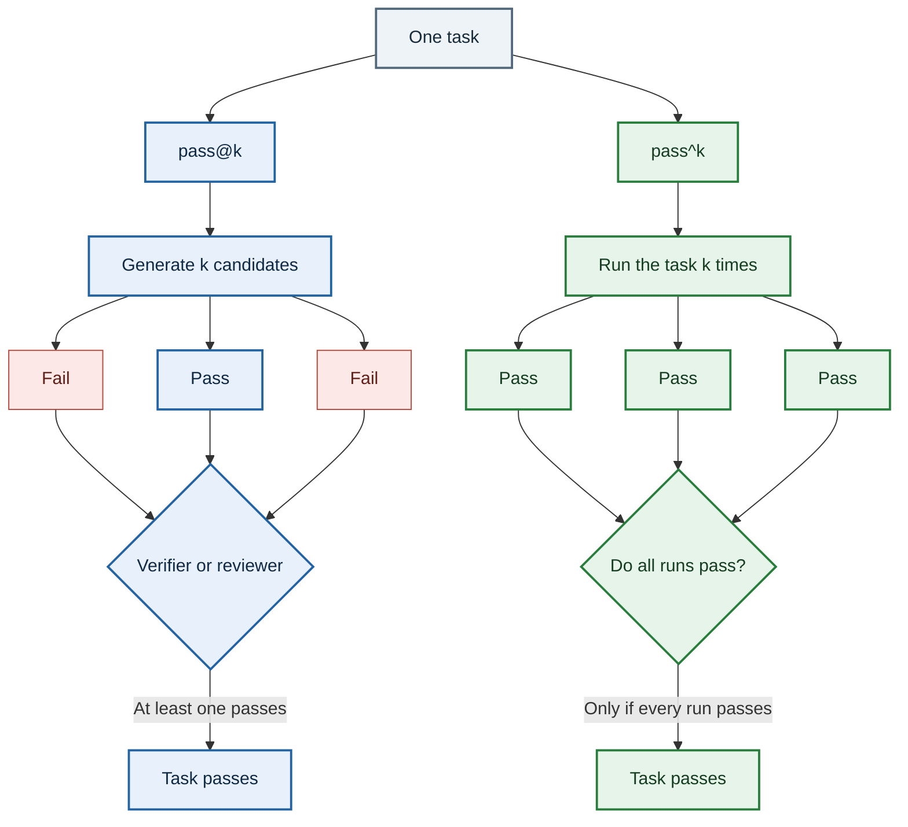
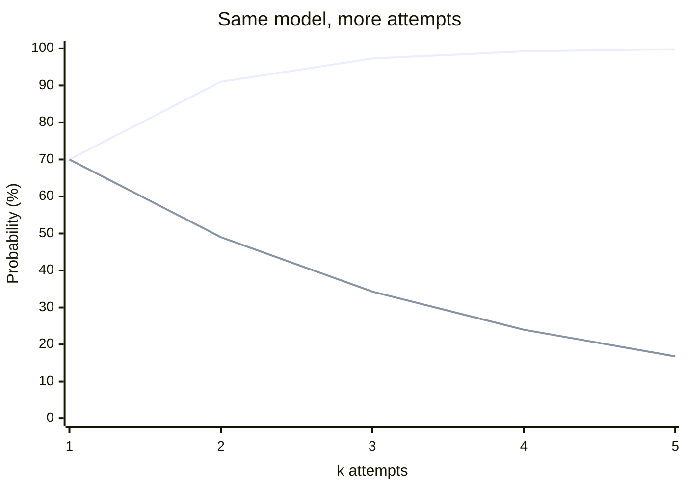
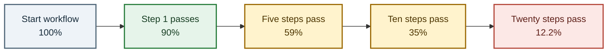

## The truth about working with LLMs

Ask an LLM the same question several times and you may get several different answers. One response
might be correct, another subtly wrong, and a third unusable. That variation is a normal part of
sampling from a language model.

This might be okay when you are getting started. 
But at some point , you must start asking the hard questions.
How much can you trust your model?
Will your model actually get to an answer?
Can you reliably run the agent automation and expect it to the right thing?

All these questions imply the need of a mental model to check how good is your model/agent performace.
This bring us to `pass@k` and `passˆk` scores.

In its simplest form, for an agent that repeats a task `k` times,
**pass@k** asks: Did at least one of the `k` attempts succeed?  
**pass^k** asks: Did every one of the `k` attempts succeed?

> At `k = 1`, they are the same measurement. As `k` grows, they reveal different properties.

- `pass@k` measures **capability**. Can repeated sampling uncover a correct answer?
- `pass^k` measures **reliability**. Can the model produce a correct answer consistently?
<br />
<br />

Pass@K and PassˆK must **NOT** be the only metrics you use for evals.  
These are only introductory heuristics.



## The model solved it. Eventually.

You give a coding model a problem.

The first answer fails the tests. The second one does not compile. The third one handles the happy
path but forgets that empty arrays exist. The fourth answer works.

Did the model pass?

If you are exploring what the model **can** do, the answer is yes. It found a valid solution.

If this model is running an unattended production workflow, the answer is a nervous no. Three out
of four runs failed.

Both conclusions are correct. They are answering different questions.

`pass@4` records the one working answer and says the model demonstrated the capability.   
`pass^4` records the three failures and says the model was not reliable across all four attempts.

The symbols are almost identical. The operational meaning is not.

## Pass@k: Give the model more lottery tickets

`pass@k` measures the probability that **at least one** of `k` attempts is correct.

For `pass@1`, the model gets one attempt. Either it works or it does not.

For `pass@10`, the model gets ten attempts. Nine can fail spectacularly. If one passes, the task
counts as a success.

This is useful. It tells you whether the model has the solution somewhere inside its distribution.
If you have tests, a verifier, a human reviewer, or another system that can select the good answer,
then generating several candidates is a legitimate product strategy.

It is also why `pass@k` rises as `k` grows. More attempts create more opportunities to get lucky.

Assume one attempt has probability `p` of succeeding and each attempt is independent. The chance
that all `k` attempts fail is `(1 - p)^k`, so:

```text
pass@k = 1 - (1 - p)^k
```

If a model succeeds 70% of the time:

```text
pass@1 = 70%
pass@3 = 1 - (1 - 0.70)^3
       = 97.3%
```

That looks excellent. Give the model three attempts and it will produce at least one correct answer
97.3% of the time.

But someone still has to identify which answer is correct.

> `pass@k` quietly assumes there is a selection mechanism after generation. 
A test suite can do that for code. A symbolic checker can do it for maths. A human can do it for a draft.
Without a reliable judge, ten answers may just give you ten confidently written things to inspect.

## Pass^k: Every ticket must win

`pass^k` asks the opposite question: what is the probability that **all** `k` attempts are correct?

Under the same independent-attempt assumption:

```text
pass^k = p^k
```

For the same model with a 70% single-attempt success rate:

```text
pass^1 = 70%
pass^3 = 0.70^3
       = 34.3%
```

Same model. Same task. Same three attempts.

- `pass@3` says **97.3%**
- `pass^3` says **34.3%**

That is not a rounding error. That is a completely different story.

`pass@3` tells us the model is highly capable when retries and selection are available.

`pass^3` tells us that only about one-third of three-run groups are flawless. If every run can send
an email, modify a database, approve a refund, or merge code, that distinction matters a lot.




Capability is finding one path that works. Reliability is avoiding all the paths that do not.



## The two metrics move in opposite directions

For an imperfect model, increasing `k` makes the metrics separate:

| Metric | What must happen? | As `k` grows | Useful when |
| --- | --- | --- | --- |
| `pass@k` | At least one attempt succeeds | Goes up | You can retry and select a winner |
| `pass^k` | Every attempt succeeds | Goes down | Every run must be dependable |

For a model with a 70% single-attempt success rate, the separation looks like this:



This creates a fun benchmark trick.

If a model has a 20% chance of solving a difficult problem in one attempt, its `pass@1` is only 20%.
But its theoretical `pass@20` is about 98.8%.

The model did not suddenly become five times smarter. We bought it nineteen more lottery tickets.

That may still be useful! Search, retries, and verification are real system components. The mistake
is presenting `pass@20` as if it describes the experience of a user who asks once and accepts the
first answer.

## But how do I already know the success rate?

The previous formulas assume we already know the model's true success probability `p`. In an
evaluation, we do not know it. We generate samples and estimate it.

Suppose a benchmark generates:

- `n` total answers for one problem
- `c` correct answers
- and wants to evaluate groups of `k` answers

The standard estimator introduced with [HumanEval][HumanEval paper] and used by its
[reference implementation][HumanEval implementation] for `pass@k` is:

```text
pass@k = 1 - C(n - c, k) / C(n, k)
```

`C(a, b)` means "the number of ways to choose `b` items from `a` items."

> The fraction calculates how many groups of `k` contain only failures. Subtracting it from 1 gives the fraction containing **at least one success**.

The matching estimator for `pass^k` is:

```text
pass^k = C(c, k) / C(n, k)
```

> Here we count only groups where all `k` selected answers come from the correct answers.

For example, imagine we generated 10 answers and 7 passed:

```text
n = 10
c = 7
k = 3

pass@3 = 1 - C(3, 3) / C(10, 3)
       = 119 / 120
       = 99.2%

pass^3 = C(7, 3) / C(10, 3)
       = 35 / 120
       = 29.2%
```

The numbers differ slightly from the earlier 97.3% and 34.3% because this calculation operates on
the ten samples we actually observed, without replacement. The earlier calculation assumed an
underlying 70% success probability and independent future attempts.

Same intuition. Different statistical question.

## Pass@k is not dishonest

It is tempting to look at the gap and declare `pass@k` a misleading metric.

That would be unfair.

`pass@k` is excellent at measuring **coverage**:

- Can the model solve this problem at all?
- Does sampling reveal a correct reasoning path?
- Can a verifier-backed system find a good candidate?
- Does the model produce diverse solutions rather than repeating one mistake?

For a coding assistant, this can match reality. Generate several implementations, run tests, and
show the developer the one that passes. The retries are part of the product.

The problem begins when we use a capability metric to make a reliability claim.

> "The model gets 95% on pass@10" does not mean "the model is correct 95% of the time."

It means that, under that benchmark's prompt, sampling settings, tests, and candidate count, at
least one of ten generated answers passed for 95% of tasks.

That is valuable information. It is just a longer sentence than the leaderboard usually prints.

## When pass^k matters

`pass^k` becomes important as we move from **augmentation** to **automation**. This distinction
also appears in recent [agent reliability research][agent reliability]: humans can absorb some
inconsistency in augmentation tools, while autonomous systems turn unreliable output directly into
unreliable action.

With augmentation, a human remains in the loop:

- A developer reviews generated code
- An analyst checks a generated query
- A writer edits a generated draft
- An operator approves the proposed action

One bad attempt is inconvenient. The human is the reliability layer.

With automation, the output becomes the action:

- The agent changes production configuration
- The workflow sends messages to customers
- The system updates financial records
- The bot closes incidents or deletes resources

Now one bad attempt can be the whole incident.

An agent that succeeds nine times out of ten may sound production-ready. Run it through a 20-step
workflow where every step must succeed, and the probability of a flawless run is:

```text
0.9^20 = 12.2%
```

This is why long agent workflows feel more fragile than their individual demos. Small failure rates
compound.



## What should you report?

There is no single perfect number. Report the metric that matches how the system will be used.

### Report pass@1

This is the clean baseline. What happens when the user asks once and accepts one answer?

### Report pass@k when retries are real

Use it when your actual system generates `k` candidates and has a credible way to select one:

- Tests
- A formal verifier
- A deterministic constraint checker
- A human reviewer
- A separately evaluated reranker

Do not report `pass@100` for a product that only generates one answer.

### Report pass^k when consistency matters

Use it when repeated runs should remain correct, or when a sequence contains several opportunities
for failure.

This is especially relevant for autonomous agents, regression testing, safety-sensitive actions,
and workflows without a human backstop.

### Report both

The gap between the metrics is itself useful:

- High `pass@k`, low `pass^k`: capable but inconsistent
- Low `pass@k`, low `pass^k`: the task is beyond the model
- High `pass@k`, high `pass^k`: capable and dependable

That tells a much richer story than one leaderboard number.

## A few traps before you calculate either

### Attempts are not always independent

Models can repeat the same reasoning pattern, especially at low temperature. Agent runs may share
the same retrieved documents, tools, cached state, or environmental failure. The simple `p`
formulas are intuition, not a guarantee that real runs behave independently.

### Correctness is only as good as the judge

A code sample "passes" because it passed the available tests. Missing tests can turn a wrong answer
into a benchmark success. A flaky evaluator can turn the metric into noise.

### Sampling settings are part of the metric

Temperature, prompts, tool access, token limits, and model versions all change the result. Comparing
two `pass@k` numbers with different evaluation setups is not a clean model comparison.

### Reliability has more than one dimension

`pass^k` captures repeated correctness. It does not measure calibration, safety, robustness to
prompt changes, recovery from tool failures, or behavior under a changing environment.

It is a useful reliability lens, not the entire reliability department.

## Key takeaways

1. **`pass@k` measures capability** - at least one of `k` attempts must succeed.
2. **`pass^k` measures consistency** - all `k` attempts must succeed.
3. **More retries make `pass@k` rise** - capability becomes easier to discover.
4. **More required successes make `pass^k` fall** - unreliability compounds.
5. **Retries need a judge** - multiple candidates help only if you can identify the good one.
6. **Automation raises the bar** - a human can absorb inconsistency; an unattended workflow cannot.
7. **Report both when trust matters** - one tells you what the model can do, the other how often you
   can depend on it.

## Conclusion

`pass@k` and `pass^k` are not competitors. They are two camera angles on the same model.

One finds the best run. The other refuses to forget the bad ones.

If you are building a demo, exploring the edge of model capability, or using a strong verifier,
`pass@k` is exactly the question you want to ask.

If you are giving an agent tools, permissions, and the ability to act without approval, ask the
other question too:

> It succeeded once. Will it succeed again?

That is the difference between a model that can impress you and a system you can trust.

## References

- [Evaluating Large Language Models Trained on Code][HumanEval paper] - the HumanEval paper that
  introduced the `pass@k` estimator.
- [OpenAI HumanEval `pass@k` implementation][HumanEval implementation] - the reference code for the
  unbiased estimator used above.
- [Towards a Science of AI Agent Reliability][agent reliability] - recent work on why consistency
  matters as models move from augmentation to automation.

[HumanEval paper]: https://arxiv.org/abs/2107.03374 "Evaluating Large Language Models Trained on Code"
[HumanEval implementation]: https://github.com/openai/human-eval/blob/master/human_eval/evaluation.py "OpenAI HumanEval pass@k implementation"
[agent reliability]: https://arxiv.org/abs/2602.16666 "Towards a Science of AI Agent Reliability"
