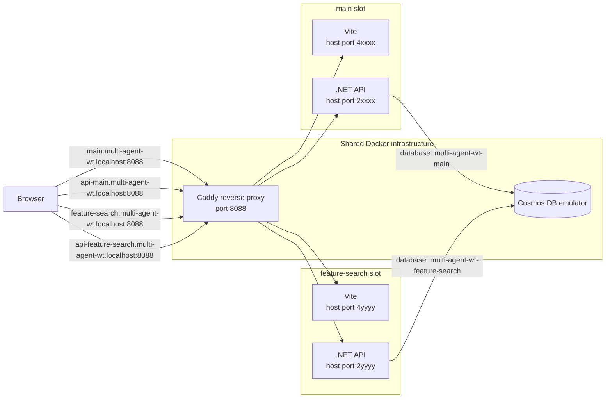
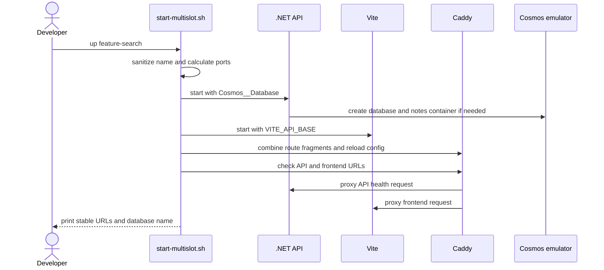

> 📚 **Companion post:** [Git Worktrees for Agentic Development](/blog/llm/git-worktrees-for-agentic-development)
> explains why worktrees are useful when people or coding agents work on several branches at once.

Most local development setups assume that only one copy of the application is running. The frontend
always uses one port, the API always uses another, and every branch connects to the same local
database. That assumption is invisible while you work on one branch at a time.

Git worktrees change the equation. They give each branch a separate directory, but they do not
isolate anything the application uses at runtime. Start the app from a second worktree and both
copies compete for the same ports. Change one copy to use different ports and its frontend still
needs to find the matching API. Even after both copies start, they can write to the same database.

This is more than inconvenient bookkeeping. You can open the frontend from one branch while it
silently calls the API from another, or test a data change against records created by a different
worktree. Two developers or coding agents can interfere with each other even though their source
files are isolated.

What we want is one independently addressable application copy per worktree, with isolated data,
without starting another copy of every heavyweight dependency.

This post builds that model with **development slots** and **Caddy**. A slot is a name for one
running copy of the application and its data boundary. The sample derives that name from the current
Git branch, so each worktree naturally gets its own slot. Caddy acts as a shared reverse proxy,
giving every slot stable URLs while its frontend and API run on separate high-numbered ports. You
can also provide a slot name explicitly.

Each slot gets:

- A stable frontend URL such as `http://feature-search.multi-agent-wt.localhost:8088`.
- A stable API URL such as `http://api-feature-search.multi-agent-wt.localhost:8088`.
- Its own frontend and API ports behind those URLs.
- Its own Cosmos DB database, such as `multi-agent-wt-feature-search`.

All slots share one Caddy proxy and one Cosmos DB emulator.

## 🧪 Try the complete sample

The working sample is in
[`MultiAgentWorktrees`](https://github.com/srungta/samples/tree/main/MultiAgentWorktrees).
It contains a React frontend, a .NET API, Docker Compose infrastructure, and the slot script used in
this post.

You need:

- Docker Desktop or Docker Engine with Compose
- .NET 10 SDK
- Node.js and pnpm
- Bash and `curl` (macOS, Linux, or WSL for multi-slot mode)

From the sample directory, run:

```bash
./start-multislot.sh infra-up
./start-multislot.sh up
```

The first command starts the shared Cosmos DB emulator and Caddy. The second command:

1. Gets the slot name from your current git branch.
2. Assigns stable frontend and API ports.
3. Chooses a database name for the slot; the API creates it on startup.
4. Starts the API and frontend.
5. Adds both hostnames to Caddy.

On the `main` branch, it prints:

```text
Slot 'main' is ready.
  Frontend: http://main.multi-agent-wt.localhost:8088
  API:      http://api-main.multi-agent-wt.localhost:8088
  Database: multi-agent-wt-main
  Logs:     /Users/you/.config/multi-agent-wt/slots/main
```

Open the frontend URL and add a note. That note is stored only in this slot's database.

If you are not in a git branch, or want a specific name, pass one:

```bash
./start-multislot.sh up demo
```

That is the entire daily startup flow.

## 🌿 Run a second branch

Create a worktree from your main clone:

```bash
git worktree add ../samples-feature-search -b feature/search
```

Enter that worktree and start its slot:

```bash
cd ../samples-feature-search/MultiAgentWorktrees
./start-multislot.sh up
```

Now both copies run at the same time:

| Branch | Frontend | Database |
| --- | --- | --- |
| `main` | `http://main.multi-agent-wt.localhost:8088` | `multi-agent-wt-main` |
| `feature/search` | `http://feature-search.multi-agent-wt.localhost:8088` | `multi-agent-wt-feature-search` |

Adding a note in one frontend does not make it appear in the other.

## 🧭 The simple mental model



There are only two kinds of resources:

**🏗️ Shared infrastructure, started once:**

- Caddy listens on port `8088` and routes requests by hostname.
- The Cosmos DB emulator listens on port `8081` and hosts many databases.

**📦 Per-slot processes, started in each worktree:**

- One Vite dev server.
- One .NET API process.
- One Cosmos database name.

## 🔀 What Caddy and a reverse proxy do

A proxy receives a request on behalf of another server. A **reverse proxy** sits in front of
application servers: the browser connects to the proxy, and the proxy chooses which application
process should receive the request. The application port stays hidden behind the proxy's stable
address.

In this sample, Caddy is the reverse proxy. Every frontend and API URL reaches Caddy on port `8088`.
Caddy reads the HTTP `Host` header, matches it against a route, and forwards the request to the
corresponding process running on a high-numbered host port. The response returns through Caddy to
the browser.

This is routing, not process isolation. The worktree isolates source files, the slot script starts
separate processes and chooses a database name, and Caddy only gives those processes stable names.

## 🌐 Why the local hostnames work

Names ending in `.localhost` resolve to the loopback address in modern browsers. You do not need to
add every slot to `/etc/hosts`.

Caddy receives all traffic on port `8088`. It uses the request hostname to choose an upstream:

```caddyfile
http://feature-search.multi-agent-wt.localhost:8088 {
	reverse_proxy host.docker.internal:40123
}

http://api-feature-search.multi-agent-wt.localhost:8088 {
	reverse_proxy host.docker.internal:20123
}
```

The actual port numbers do not matter to the person using the app. Caddy hides them behind readable,
predictable URLs.

The Caddy container reaches host-run processes through `host.docker.internal`. The Compose file adds
a host-gateway mapping for Docker Engine on Linux; Docker Desktop provides the same hostname on
macOS and Windows.

The browser calls the frontend hostname to load the UI. The frontend then calls its own API hostname,
which also goes through Caddy. Caddy does not forward traffic to Cosmos DB: each API connects
directly to the shared emulator.

## 🔒 Why the data stays isolated

Running one Cosmos emulator per worktree would use unnecessary memory. Instead, every API connects
to the same endpoint but uses a different database name:

```bash
Cosmos__Endpoint="https://localhost:8081"
Cosmos__Database="multi-agent-wt-feature-search"
```

.NET maps the double underscore in `Cosmos__Database` to the configuration key
`Cosmos:Database`.

The sample API uses the current Linux-based Cosmos DB emulator image in HTTPS mode:

```yaml
cosmos:
  image: mcr.microsoft.com/cosmosdb/linux/azure-cosmos-emulator:vnext-latest
  command: ["--protocol", "https"]
  ports:
    - "8080:8080" # readiness endpoint
    - "8081:8081" # Cosmos endpoint
    - "1234:1234" # Data Explorer
```

The vNext emulator supports the API for NoSQL in gateway mode, so the .NET client sets it explicitly:

```csharp
var cosmos = new CosmosClient(endpoint, key, new CosmosClientOptions
{
    ConnectionMode = ConnectionMode.Gateway,
    ServerCertificateCustomValidationCallback = (_, _, _) => true,
});
```

The certificate bypass is for the local emulator only. Do not use it with a production Cosmos DB
account.

## 🗂️ What the slot script records

Each slot has a small state directory under `~/.config/multi-agent-wt/slots`:

```text
~/.config/multi-agent-wt/slots/feature-search/
├── env
├── Caddyfile
├── api.pid
├── api.log
├── frontend.pid
└── frontend.log
```

The script lowercases the slot name and replaces non-alphanumeric runs with hyphens. It then hashes
that sanitized name into a stable numeric offset, adds the offset to base ports `20000` and `40000`,
and checks known slots and listening ports for a collision before starting anything.

The script injects the matching API URL into the Vite process:

```ini
VITE_API_BASE=http://api-feature-search.multi-agent-wt.localhost:8088
```

Vite listens on all host interfaces so Caddy's container can reach it:

```bash
pnpm exec vite --host 0.0.0.0 --port "$frontend_port" --strictPort
```

You do not need to copy the full orchestration script from this article. Use the tested
[`start-multislot.sh`](https://github.com/srungta/samples/blob/main/MultiAgentWorktrees/start-multislot.sh)
from the sample.

## 🚀 What happens when a slot starts



## 🛑 Stop and inspect slots

List all known slots:

```bash
./start-multislot.sh status
```

Stop only the current branch's slot:

```bash
./start-multislot.sh down
```

Stop a named slot:

```bash
./start-multislot.sh down feature-search
```

When no slots remain, stop shared infrastructure:

```bash
./start-multislot.sh infra-down
```

The script refuses to stop shared infrastructure while known slots still exist. Normal shutdown also
preserves the Cosmos Docker volume, so your local data survives a restart.

## ♻️ The pattern to reuse

You can adapt the sample to another project by changing four things:

1. Replace `multi-agent-wt.localhost` with your local domain.
2. Replace the commands that start the frontend and API.
3. Pass a slot-specific database, schema, or tenant name to your backend.
4. Keep shared services in the infrastructure Compose file and lightweight app processes per slot.

The important idea is not the exact script. It is the separation of concerns:

- Git worktrees isolate files and branches.
- Caddy gives changing processes stable names.
- Per-slot database names isolate data.
- Shared infrastructure keeps the setup light enough to run many copies.

With those boundaries in place, running another branch becomes one command instead of another round
of port and configuration bookkeeping.

## ✅ Prerequisites for adapting this pattern

The orchestration script cannot create isolation if the application has fixed addresses or hidden
shared state. Before applying this pattern to another project, make sure it supports the following
capabilities.

### ⚙️ Runtime configuration

The frontend must read its API base URL from configuration rather than embedding it in the source.
The backend must do the same for its database endpoint, credentials, and database name. In this
sample, the relevant values are:

```ini
VITE_API_BASE=http://api-feature-search.multi-agent-wt.localhost:8088
Cosmos__Endpoint=https://localhost:8081
Cosmos__Database=multi-agent-wt-feature-search
```

The frontend and API must also accept a port at startup. Each slot needs different listening ports,
even though Caddy hides those ports from the browser.

### 🧱 A per-slot data boundary

The shared data service must provide a namespace that can be selected through configuration. That
boundary is a Cosmos database in this sample, but it could be a PostgreSQL database or schema, a
storage prefix, or a tenant identifier. Every read, write, migration, and background job must use
the selected namespace; one hard-coded database or globally shared queue can break slot isolation.

### 🗄️ Repeatable database creation and migration

A new slot starts with a new database name, so the application needs an initialization path. The
sample API uses `CreateDatabaseIfNotExistsAsync` and `CreateContainerIfNotExistsAsync` during
startup. A larger application might run a separate provisioning or migration command instead.

Whichever approach you use, it should:

- Accept the slot-specific database or schema name as input.
- Be idempotent, so restarting a slot is safe.
- Apply all schema migrations required by the branch being started.
- Fail before the slot is advertised as ready if provisioning does not succeed.

Be deliberate about incompatible migrations. Slots isolate database names, but they still share the
same database server or emulator version.

### 🔌 Reachable services and allowed origins

Caddy must be able to reach the frontend and API processes. In the sample they bind to `0.0.0.0`
because Caddy runs in Docker and connects through `host.docker.internal`. If Caddy runs directly on
the host, binding to loopback may be enough.

The API must also allow requests from each slot's frontend origin. The sample allows every CORS
origin for local development. A real project should generate an allowlist or safely validate the
local slot domain instead of carrying that permissive policy into production.

### 🩺 Readiness and lifecycle commands

The slot manager needs a lightweight API health endpoint and a frontend URL it can probe before it
reports success. It also needs reliable commands for starting and stopping both processes, plus a
place to record their PIDs, logs, assigned ports, and proxy routes.

Finally, decide what `down` means for data. This sample stops the processes and removes the Caddy
route but preserves the slot's Cosmos database. Projects that need disposable slots should add an
explicit database cleanup command rather than deleting data as a side effect of ordinary shutdown.
