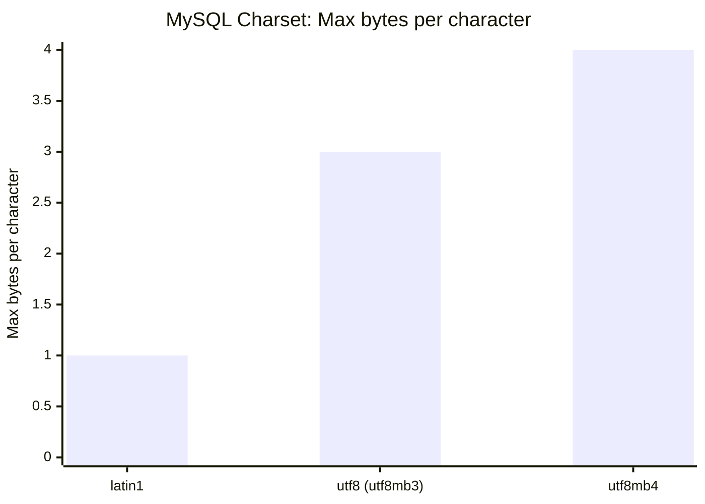

* TOC
{:toc}

## The Incident: 💩 Breaks Production

**Date:** Friday, 5:47 PM  
**Severity:** P0 - Complete service outage  
**Root cause:** 💩  

**Incident report:**

```
5:47 PM - User changes display name to "John 💩"
5:47 PM - Application crashes
5:48 PM - All requests to database timeout
5:49 PM - Site down for all users
5:52 PM - Engineers roll back last deployment
5:53 PM - Rollback fails
5:54 PM - Database locked
5:55 PM - Everyone panics
```

**Actual cause:** The 💩 emoji is 4 bytes in UTF-8. Your database column was `VARCHAR(100)` in a charset that assumes 1 byte = 1 character. MySQL interpreted this as 4 characters. A 100-character limit became a 25-character limit. The emoji didn't fit. Transaction failed. Database locked. Cascading failure.

**Estimated cost:** $50,000 in lost revenue, 3 engineers working until midnight, 1 pizza delivery, infinite embarrassment.

**The real lesson:** Unicode is hard. And emoji are Unicode's final boss.

```mermaid
timeline
    title Incident Timeline — Friday Evening
    5&#58;47 PM : User sets display name to "John 💩"
              : Application crashes
    5&#58;48 PM : All database requests timeout
    5&#58;49 PM : Site down for all users
    5&#58;52 PM : Engineers attempt rollback
    5&#58;53 PM : Rollback fails
    5&#58;54 PM : Database locked
    5&#58;55 PM : Everyone panics 🔥
```



## Chapter 1: What Even Is Unicode?

### ASCII (The Simple Days)

```
A = 65
B = 66
...
Z = 90
```

128 characters total. All English letters, numbers, basic punctuation. 7 bits. Life was simple. ([Wikipedia: ASCII](https://en.wikipedia.org/wiki/ASCII))

**Then the world happened.**

### Unicode (The Complicated Now)

```
A = U+0041 (Latin Capital Letter A)
Á = U+00C1 (Latin Capital Letter A with Acute)
А = U+0410 (Cyrillic Capital Letter A)
Α = U+0391 (Greek Capital Letter Alpha)
𝐀 = U+1D400 (Mathematical Bold Capital A)
```

[140,000+ characters.](https://www.unicode.org/versions/Unicode15.1.0/) Multiple ways to represent the same thing. Combining characters. Emoji. Emoji with skin tones. Emoji combined with other emoji.

**Unicode went from "character set" to "every written symbol in human history plus emoji."**


## Chapter 2: The Many Ways Characters Lie About Their Size

### Size Lie #1: UTF-8 Variable Length

```javascript
'A'.length;        // 1 (1 byte in UTF-8)
'€'.length;        // 1 (3 bytes in UTF-8)
'💩'.length;       // 2 (4 bytes in UTF-8, but JavaScript counts UTF-16 units)
```

**Your database column:** `VARCHAR(100)` thinking 100 bytes

**What fits:**
- 100 ASCII characters ✅
- 33 Euro signs ([3 bytes each](https://en.wikipedia.org/wiki/UTF-8#Encoding))
- 25 emoji ([4 bytes each](https://www.unicode.org/reports/tr51/))

### Size Lie #2: Combined Characters

```javascript
'é'.length;  // Could be 1 or 2!

// Option 1: Single character (NFC - composed)
'é' = U+00E9 (1 character)

// Option 2: Base + combining accent (NFD - decomposed)  
'e' + '́' = U+0065 + U+0301 (2 characters)
```

**They look identical. They're different in memory.**

**Your comparison:**

```javascript
'é' === 'é'  // Sometimes false!

'é'.normalize() === 'é'.normalize()  // True
```

**Your database:** Indexes them as different values. Searches fail mysteriously.

### Size Lie #3: Emoji Combiners

```javascript
'👨‍👩‍👧‍👦'.length;  // 11

// Actually:
'👨' + ZWJ + '👩' + ZWJ + '👧' + ZWJ + '👦'
// Man + Zero Width Joiner + Woman + ZWJ + Girl + ZWJ + Boy
// = Family emoji (displays as 1)
```

**Your character counter:** "This is 11 characters"  
**User sees:** 1 emoji  
**Your validation:** "That's fine"  
**Your database:** "This is 44 bytes (11 × 4). Too long."

```mermaid
flowchart LR
    A["👨\nU+1F468\n4 bytes"] -->|ZWJ\nU+200D| B["👩\nU+1F469\n4 bytes"]
    B -->|ZWJ\nU+200D| C["👧\nU+1F467\n4 bytes"]
    C -->|ZWJ\nU+200D| D["👦\nU+1F466\n4 bytes"]
    D --> E["👨‍👩‍👧‍👦\nLooks like: 1 char\n.length = 11\nBytes = 25"]
    style E fill:#1a3a1a,stroke:#3fb950
```



## Chapter 3: Real-World Horror Stories

### Story 1: The Name That Broke Authentication

**User:** Robert'); DROP TABLE Students;--

**Just kidding. Real story:**

**User:** José  
**Your system:** Stores as "José" (NFC normalized)  
**User logs in again:** Types "José" (NFD normalized)  
**Your system:** "Who's José? I don't know that user."

**Fix:** Normalize all input before comparison

```javascript
function normalizeText(str) {
  return str.normalize('NFC');
}

username === savedUsername  // ❌ Can fail
normalizeText(username) === normalizeText(savedUsername)  // ✅ Works
```

### Story 2: The Email That Traveled Through Time

**User in Japan:** Sends email with kanji characters  
**Email server 1 (UTF-8):** Passes it along fine  
**Email server 2 (ISO-8859-1):** Can't handle kanji, converts to `?`  
**Email server 3 (UTF-8):** Sees `?` and assumes that's the data  
**Recipient:** Gets email full of `?` characters

**This is mojibake.** Text corrupted by charset mismatches.

**The fix:** Always specify charset in Content-Type headers

```
Content-Type: text/html; charset=UTF-8
```



```mermaid
flowchart LR
    A["✅ Original\nこんにちは\nUTF-8 · 15 bytes"] -->|Server 1\nUTF-8 ✓| B["✅ Intact\nこんにちは"]
    B -->|Server 2\nISO-8859-1 ✗| C["❌ Mojibake\n??????????\nKanji replaced"]
    C -->|Server 3\nUTF-8| D["❌ Stored as valid\n??????????"]
    D --> E["😢 Recipient\n??????????\nData permanently lost"]
    style C fill:#3a1a00,stroke:#ff6600
    style D fill:#3a1a00,stroke:#ff6600
    style E fill:#3a0000,stroke:#ff4444
```

### Story 3: The Tweet That Was Too Long

**Twitter:** "Tweets are limited to 280 characters"

**User tweets:** "🏴󠁧󠁢󠁥󠁮󠁧󠁿🏴󠁧󠁢󠁳󠁣󠁴󠁿🏴󠁧󠁢󠁷󠁬󠁳󠁿" (3 flag emoji)

**Twitter's counter:** "This is 3 characters"  
**Reality:** This is 42 code points (14 per flag)

**Result:** Tweet submits, breaks some clients, displays wrong on some platforms.

**Twitter's eventual fix:** Count by "grapheme clusters" not code points.

### Story 4: The Database Migration That Deleted Data

**Scenario:** Migrating from MySQL with `latin1` to `utf8mb4`

```sql
-- Old table
CREATE TABLE users (
  name VARCHAR(100) CHARACTER SET latin1
);

-- New table
CREATE TABLE users (
  name VARCHAR(100) CHARACTER SET utf8mb4
);
```

**The trap:** 
- `latin1`: 1 byte per character, so VARCHAR(100) = 100 bytes
- `utf8mb4`: Up to 4 bytes per character, so VARCHAR(100) = 400 bytes max

**But MySQL also has a [row size limit (65,535 bytes)](https://dev.mysql.com/doc/refman/8.0/en/column-count-limit.html).**

**If you have 200 VARCHAR(100) columns:**
- `latin1`: 200 × 100 = 20,000 bytes ✅
- `utf8mb4`: 200 × 400 = 80,000 bytes ❌ EXCEEDS LIMIT

**Migration fails. Data truncated. Users lose data.**

**The fix:** Reduce VARCHAR sizes or split across tables.

### Story 5: The Search That Found Nothing

**User searches for:** "café"  
**Database has:** "cafe", "café", "café" (composed), "café" (decomposed)

**Your search:**

```sql
SELECT * FROM places WHERE name = 'café';
```

**Results:** Only exact matches. Misses variations.

**The fix:** Normalize before storing, normalize before searching

```sql
-- PostgreSQL example
SELECT * FROM places WHERE unaccent(name) = unaccent('café');
```

### Story 6: The URL That Broke Routing

**User creates profile:** `https://site.com/users/José`

**Browser URL-encodes:** `https://site.com/users/Jos%C3%A9`

**Your router:**

```javascript
app.get('/users/:name', (req, res) => {
  const user = getUser(req.params.name);
  // req.params.name is "Jos%C3%A9" or "José" depending on framework
});
```

**Some frameworks decode. Some don't. Bugs everywhere.**

**The fix:** Always use IDs in URLs, not names

```javascript
// Bad
/users/José

// Good
/users/123
```

## Chapter 4: The Emoji Special Cases

### [Skin Tone Modifiers](https://www.unicode.org/reports/tr51/#Emoji_Modifiers_Table)

```javascript
'👋'.length;      // 2 (base emoji)
'👋🏻'.length;     // 4 (base emoji + skin tone modifier)
```

**Your emoji picker:** Shows 5 skin tone options  
**Your database:** Each takes different space  
**Your character limit:** Surprises await

### [Flags](https://www.unicode.org/reports/tr51/#flag-emoji-tag-sequences)

```javascript
'🇺🇸'.length;     // 4

// Actually two "Regional Indicator" characters:
// U+1F1FA (Regional Indicator U) + U+1F1F8 (Regional Indicator S)
// = US flag
```

**Your database:** Doesn't recognize this as one flag  
**Your rendering:** Might show "U" "S" instead of 🇺🇸

### Gender and Profession Variations

```javascript
'👨'              // Man
'👨‍⚕️'             // Man + ZWJ + Medical symbol = Male doctor
'👩‍⚕️'             // Woman + ZWJ + Medical symbol = Female doctor
'🧑‍⚕️'             // Person + ZWJ + Medical symbol = Doctor (gender neutral)
```

**Each variation:** Different byte count  
**Your system:** Might treat them as completely different inputs

```mermaid
block-beta
  columns 4
  base["Base person"]:1
  space
  zwj["+ ZWJ +"]:1
  space
  prof["Profession symbol"]:1
  space
  result["= Variant emoji"]:1
  space
  m["👨 U+1F468"]:1 space mzwj["+ZWJ+"] space mdoc["⚕️ U+2695"]:1 space mres["👨‍⚕️ Male doctor"]:1
  f["👩 U+1F469"]:1 space fzwj["+ZWJ+"] space fdoc["⚕️ U+2695"]:1 space fres["👩‍⚕️ Female doctor"]:1
  n["🧑 U+1F9D1"]:1 space nzwj["+ZWJ+"] space ndoc["⚕️ U+2695"]:1 space nres["🧑‍⚕️ Neutral doctor"]:1
  style mres fill:#1a3a1a
  style fres fill:#1a3a1a
  style nres fill:#1a3a1a
```



## Chapter 5: The Database Encoding Trap

### MySQL Character Sets (A History of Mistakes)

**`latin1`** (default for ancient MySQL)
- 1 byte per character
- Only Western European languages
- Can't store emoji

**[`utf8`](https://dev.mysql.com/doc/refman/8.0/en/charset-unicode-utf8.html)** (MySQL's version, not real UTF-8)
- Max 3 bytes per character
- Can store most characters
- **Cannot store emoji** (emoji need 4 bytes)

**[`utf8mb4`](https://dev.mysql.com/doc/refman/8.0/en/charset-unicode-utf8mb4.html)** (actual UTF-8)
- Max 4 bytes per character
- Can store emoji
- **This is what you want**

**The trap:**

```sql
-- Your table uses default charset (latin1)
CREATE TABLE users (name VARCHAR(100));

-- User tries to save emoji
INSERT INTO users (name) VALUES ('Alice 😀');

-- MySQL:
-- ❌ Error: Incorrect string value
-- OR
-- ⚠️ Silently truncates emoji
```

**The fix:**

```sql
-- Specify utf8mb4 explicitly
CREATE TABLE users (
  name VARCHAR(100) CHARACTER SET utf8mb4 COLLATE utf8mb4_unicode_ci
);

-- Or set database default
ALTER DATABASE mydb CHARACTER SET utf8mb4 COLLATE utf8mb4_unicode_ci;
```

### PostgreSQL (Mostly Gets It Right)

PostgreSQL uses UTF-8 by default. Emoji just work. But:

```sql
-- This still breaks
CREATE TABLE users (name CHAR(10));
INSERT INTO users (name) VALUES ('Hello 👋');

-- CHAR is fixed-length in characters, not bytes
-- Emoji counts as 1 character but takes 4 bytes
```

**The fix:** Use `VARCHAR` or `TEXT`, not `CHAR`.



## Chapter 6: The Application Layer Traps

### Trap 1: String Length Validation

```javascript
// User enters: "Hello 👨‍👩‍👧‍👦"
const input = "Hello 👨‍👩‍👧‍👦";

// Wrong
if (input.length > 20) {
  throw new Error('Too long');
}
// input.length = 16 (11 for emoji + 6 for "Hello ")

// Right
const segmenter = new Intl.Segmenter('en', { granularity: 'grapheme' });
const graphemes = Array.from(segmenter.segment(input));
if (graphemes.length > 20) {
  throw new Error('Too long');
}
// graphemes.length = 7 (1 for emoji + 6 for "Hello ")
```

### Trap 2: Substring Operations

```javascript
const text = "Hello 👨‍👩‍👧‍👦 World";

// Wrong
text.substring(0, 10);  // "Hello 👨‍�" (cuts emoji in half!)

// Right - use grapheme-aware libraries
// Or avoid substring with emoji
```

### Trap 3: Regex Matching

```javascript
// Match any single character
const regex = /^.$/;

'A'.match(regex);           // ✅ Match
'💩'.match(regex);          // ❌ No match (2 UTF-16 units)
'👨‍👩‍👧‍👦'.match(regex);      // ❌ No match (11 UTF-16 units)

// Better
const regex = /^.$/u;  // Unicode flag
'💩'.match(regex);          // ✅ Match

// But still won't match combined emoji
'👨‍👩‍👧‍👦'.match(regex);      // ❌ Still no match
```

## Chapter 7: The Fixes

### Fix 1: Use UTF-8 Everywhere

```
Database: utf8mb4
API responses: Content-Type: application/json; charset=UTF-8
HTML: <meta charset="UTF-8">
Files: Save as UTF-8 with BOM
Environment: Set LANG=en_US.UTF-8
```

### Fix 2: Normalize User Input

```javascript
function normalizeInput(str) {
  return str
    .normalize('NFC')          // Normalize to composed form
    .trim();                   // Remove whitespace
}
```

### Fix 3: Count Graphemes, Not Code Points ([Intl.Segmenter](https://developer.mozilla.org/en-US/docs/Web/JavaScript/Reference/Global_Objects/Intl/Segmenter))

```javascript
function countGraphemes(str) {
  const segmenter = new Intl.Segmenter('en', { granularity: 'grapheme' });
  return Array.from(segmenter.segment(str)).length;
}
```

### Fix 4: Validate Before Storing

```javascript
function validateText(str, maxLength) {
  const graphemes = countGraphemes(str);
  const bytes = new TextEncoder().encode(str).length;
  
  if (graphemes > maxLength) {
    throw new Error(`Too many characters (max ${maxLength})`);
  }
  
  if (bytes > maxLength * 4) {  // UTF-8 max 4 bytes per char
    throw new Error('Text too long in bytes');
  }
}
```

### Fix 5: Use TEXT Columns, Not VARCHAR

```sql
-- Instead of guessing VARCHAR size
CREATE TABLE posts (
  content VARCHAR(10000)  -- Might not be enough for emoji-heavy text
);

-- Use TEXT (or equivalent)
CREATE TABLE posts (
  content TEXT  -- Stores up to 1 GB per value in PostgreSQL (see [Character Types](https://www.postgresql.org/docs/current/datatype-character.html))
);
```

### Fix 6: Test With Emoji

```javascript
// Add these to your test suite
const testStrings = [
  'Simple ASCII',
  'Café',                    // Accented characters
  'Hello 世界',              // CJK characters
  'مرحبا',                   // RTL text
  'Hello 👋',               // Basic emoji
  '👨‍👩‍👧‍👦',                    // Combined emoji
  '🏴󠁧󠁢󠁥󠁮󠁧󠁿',                        // Flag emoji
  '👋🏻👋🏿',                   // Emoji with skin tones
  'ℌ𝔢𝔩𝔩𝔬',                // Mathematical alphanumeric symbols
];
```

## Key Takeaways

1. **Use UTF-8 (utf8mb4 in MySQL) everywhere** - No exceptions
2. **Normalize text on input** - NFC is usually the right choice
3. **Count graphemes, not code points** - Use Intl.Segmenter
4. **Test with emoji** - They will break your assumptions
5. **Never use CHAR for user input** - Use VARCHAR or TEXT
6. **Validate both length and byte size** - They're different
7. **Normalize before comparing** - 'é' has multiple representations
8. **Don't use names in URLs** - Use IDs instead

## Conclusion

Unicode is humanity's attempt to represent every written symbol in a computer. Emoji are humanity's attempt to communicate without words. Together, they create a perfect storm of edge cases.

Your `VARCHAR(255)` column isn't ready for the world. Your string length validation assumes ASCII. Your database might silently corrupt data.

The 💩 emoji didn't take down production because it's special. It took down production because it exposed the fact that your entire system assumed characters were 1 byte.

**Remember:** If your system can't handle 💩, it's not ready for production.

---

*Have emoji broken your system? Discovered creative ways characters lie about their size? Share your Unicode war stories.*
